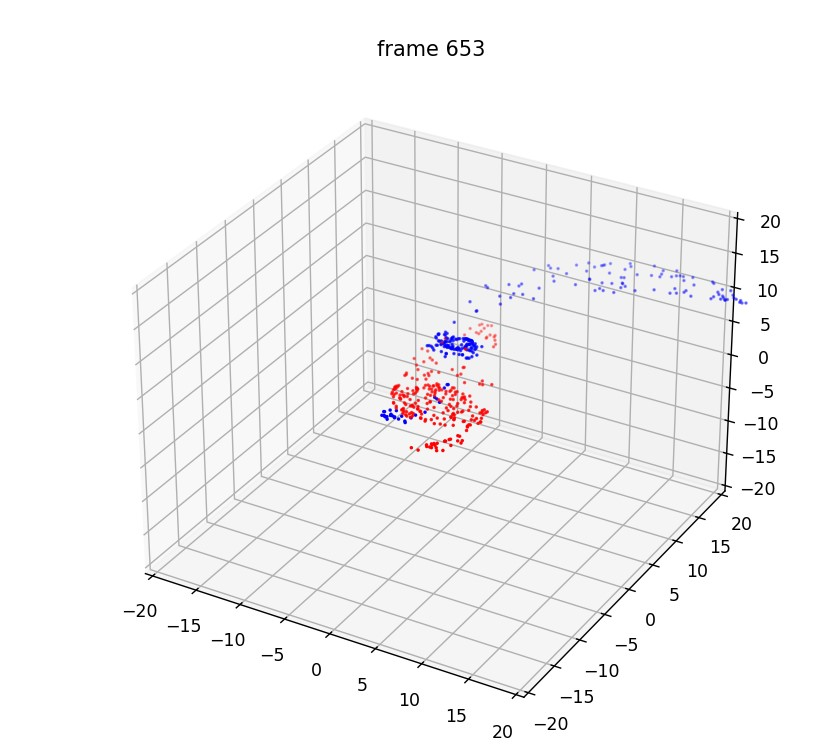

# galaxy_simulation
두 은하의 충돌을 python으로 시뮬레이션하고 matplotlib로 시각화하는 코드입니다.

[see video](https://youtu.be/efWby_ctrzI)



## How to Use

```bash
python main.py
```

입력 이후 설정값들을 입력합니다. 이후 시뮬레이션 결과가 simulation.npy 파일로 저장됩니다.

> galtheta는 은하 1의 은하면의 수직한 직선의 구면좌표계에서의 세타
>
> galphi는 은하 1의 은하면의 수직한 직선의 구면좌표계에서의 파이
>
> comptheta는 은하 2의 은하면의 수직한 직선의 구면좌표계에서의 세타
>
> compphi는 은하 2의 은하면의 수직한 직선의 구면좌표계에서의 파이
>
> total_star_num은 두 은하의 별의 수의 합
>
> 두 은하 사이의 거리는 10이 적당합니다.
>
> 은하 1에 대한 은하 2의 질량비는 제곱근한 결과가 은하 1과 은하 2의 반지름 비율이라고 보시면 됩니다.

이후 시각화를 원하시면

```bash
python make_video.py simulation.npy
```

## 참고 자료

Verkade, T. (2020). Simulating Galaxy Collisions in Python for Astronomy Education (Doctoral dissertation).
